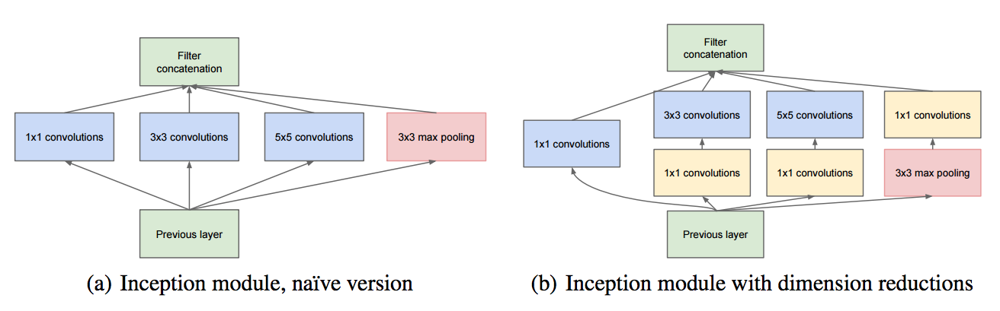

# GoogLeNet

GoogLeNet

- 2014년 ImageNet에서 개최한 ILSVRC14 에서 VGGNET을 제치고 1위
- 논문 제목 "Going Deeper With Convolutions"
- Inception이란 이름의 GoogLeNet
- GoogLeNet은 팀명, Inception 여러 버전 중 하나이며 Inception-v1 = GoogLeNet
- Network를 sparse하게 구성
    - correlation이 높은 노드끼리만 연결. → 연산량, 파라미터를 conputational resource를 적게 사용하는 방법. ⇒ overfitting 개선 (drop out 기법과 유사)
    - 그러나 실제로는 sparse matrix 연산이 더 큰 computational resource를 사용
- 아주 deep 한 신경망 → Inception Module 덕분

Inception Module

- 4가지 종류의 convolution, pooling 을 수행
- 4개의 결과를 채널 방향으로 합 침
- 이러한 Inception Module 이 총 9개
- Channel-wise Concat
- Feature Map을 추출하는 과정에서 최대한 Sparse한 연결 유지, Matrix 연산에서 최대한 Dense하게 하고자 함 ⇒ 엄청난 computational resource를 사용
- 이를 해결하기 위해 3x3, 5x5 conv 연산 전, 그리고 3x3 Maxpooling 이후 1x1 Conv가 먼저 실행

1x1 Conv

- 핵심적인 역할
- channel을 줄였다가 3x3이나 5x5로 확장 ⇒ 필요한 연산양을 감소
- 채널 수 조절 기능
    - 채널 간 correlation 연산
- 채널 감소 ⇒ 파라미터 수 감소
    - 이미지 채널을 줄여준다면, 3x3과 5x5 convolution 레이어에서의 파라미터 개수를 절약
    - 덕분에 기존의 CNN 구조들 보다 더욱 깊게 만들고도 파라미터가 그리 크지 않다.

Auxiliary Classifier

- 중간 단계에서 예측 결과를 출력하여 정규화 효과를 노린것 (Local response normalization)
- Vanishing gradient 대비, 적절하게 BackPropagation이 적용되기 위한 방법
- 계산된 error 값들은 0.3 가중치를 곱해 최종 error 값에 더해짐.

